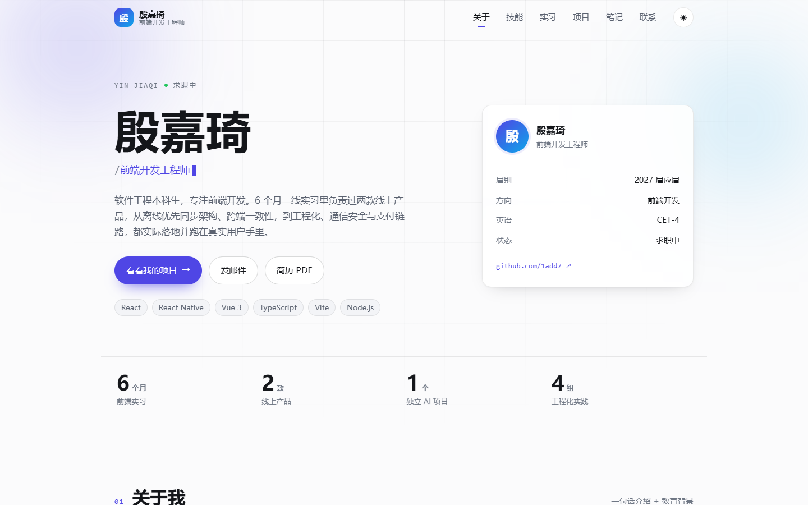

# 殷嘉琦 · 个人主页 / 网站简历

> 在线预览：<https://1add7.github.io/portfolio/>



用 **React 19 + TypeScript + Vite** 手写的单页个人主页，同时作为网站版简历使用。所有动画都由原生 CSS 与 `IntersectionObserver` 实现，没有引入任何动画库；构建产物是纯静态文件，托管在 GitHub Pages 上，打开链接即可查看。

## 页面内容

| 区块 | 说明 |
| --- | --- |
| 首屏 | 姓名、职位打字机轮播、关键数字（实习时长 / 线上产品数 / 独立项目数） |
| 关于我 | 个人简介、教育背景（重庆邮电大学 · 软件工程 · 2027 届）、求职意向 |
| 技能栈 | 语言与框架、网络与工程、后端与 AI、组件与规范 |
| 实习经历 | 三河星宸助手科技有限公司（2026.03—2026.09）：英语世界、指法世界 |
| 项目经历 | AI 知识树：Agent + RAG 驱动的对话式知识管理应用 |
| 笔记 | 博客雏形（占位选题，后续替换成文章） |
| 联系我 | 邮箱、电话、GitHub |

## 技术要点

- **自定义 Hook**：`useInView`（滚动入场）、`useTypewriter`（打字机）、`useCountUp`（数字递增）、`useActiveSection`（导航高亮）、`useTheme`（主题持久化）
- **滚动动画**：`IntersectionObserver` + CSS `transition`，元素进入视口后播放一次，不重复触发
- **鼠标跟随高光**：`mousemove` 写入 CSS 变量 `--mx / --my`，由 `radial-gradient` 呈现
- **时间轴生长效果**：进入视口后 `scaleY` 从 0 过渡到 1
- **深色模式**：跟随系统 `prefers-color-scheme`，可手动切换并记忆到 `localStorage`
- **无障碍**：所有动效遵循 `prefers-reduced-motion`，导航与按钮均为可聚焦元素
- **部署适配**：`vite.config.ts` 中 `base: './'`，构建产物用相对路径，根域名与 `/<仓库名>/` 子路径都能正常加载

## 本地运行

```bash
npm install
npm run dev       # 开发环境 http://localhost:5173
npm run build     # 产出 dist/
npm run preview   # 预览构建结果
npm run lint      # oxlint 检查
```

> 国内网络安装依赖较慢时可以用镜像：`npm install --registry=https://registry.npmmirror.com`

## 目录结构

```text
src/
  App.tsx                页面结构装配
  data/profile.ts        全部文案（简历内容、技能、项目、笔记选题）
  hooks/                 打字机、滚动入场、主题、数字递增等自定义 hook
  components/            每个区块一个组件 + 同名 CSS
  styles/global.css      设计令牌（颜色 / 圆角 / 动效曲线）与通用样式
public/
  resume.pdf             简历 PDF
  favicon.svg            站点图标
docs/
  preview.png            README 预览图
```

## 如何自定义

- **改文案 / 项目 / 技能**：编辑 `src/data/profile.ts`，其余文件不用动
- **显示头像**：把照片放到 `public/avatar.jpg`，再把 `profile.avatar` 设为 `'avatar.jpg'`
- **换主题色**：改 `src/styles/global.css` 里的 `--accent` 与 `--accent-2`
- **更新简历 PDF**：用新文件覆盖 `public/resume.pdf`
- **调整笔记区**：`src/data/profile.ts` 里的 `notes`

## 部署

仓库已配置 GitHub Actions（`.github/workflows/deploy.yml`）：推送到 `main` 分支后自动执行 `npm ci && npm run build`，并把 `dist/` 发布到 GitHub Pages。

其它静态托管同样可用 —— Vercel / Netlify / Cloudflare Pages：Build Command 填 `npm run build`，Output Directory 填 `dist`。

页面是锚点导航的单页应用，没有使用 history 路由，因此不需要配置 404 重写规则。
